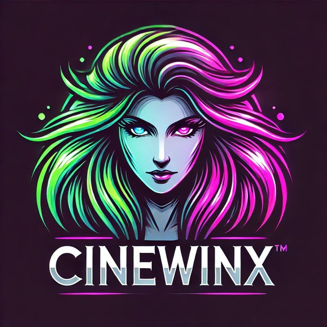

<table style="width:100%" align="center" border="0">
  <tr align="center">
    <td></td>
    <td><h1>🎥 ＣｉｎｅＷｉｎｘ 📼</h1></td>
  </tr>
</table>

<p align="center">
  <strong>An open-source API for index and stream movies and series using <a href="https://t.me/cinewinxy">CineWinx</a> channel.</strong>
</p>

<p align="center">
  
  
  
  
  
  <a href="https://github.com/gabrielmaialva33/cinewinx-api/commits/master">
    
      
  </a>
</p>

<br>

<p align="center">
  <a href="#bookmark-about">About</a>&nbsp;&nbsp;&nbsp;|&nbsp;&nbsp;&nbsp;
  <a href="#computer-technologies">Technologies</a>&nbsp;&nbsp;&nbsp;|&nbsp;&nbsp;&nbsp;
  <a href="#wrench-tools">Tools</a>&nbsp;&nbsp;&nbsp;|&nbsp;&nbsp;&nbsp;
  <a href="#package-installation">Installation</a>&nbsp;&nbsp;&nbsp;|&nbsp;&nbsp;&nbsp;
  <a href="#memo-license">License</a>
</p>

<br>

## :bookmark: About

**ＣｉｎｅＷｉｎｘ** is an open-source API for index and stream movies and
series using the **[CineWinx](https://t.me/cinewinxy)** channel.
This project was developed using **[AdonisJS](https://adonisjs.com/)**
and **[GramJS](https://gram.js.org/introduction/)**.

<br>

## :computer: Technologies

- **[Typescript](https://www.typescriptlang.org/)**
- **[Node.js](https://nodejs.org/)**
- **[AdonisJS](https://adonisjs.com/)**
- **[GramJS](https://gram.js.org/introduction/)**
  <br>

## :wrench: Tools

- **[Docker](https://www.docker.com/)**
- **[WebStorm](https://www.jetbrains.com/webstorm/)**

<br>

## :package: Installation

### :heavy_check_mark: **Prerequisites**

The following software must be installed:

- **[Node.js](https://nodejs.org/en/)**
- **[Git](https://git-scm.com/)**
- **[NPM](https://www.npmjs.com/)** or **[pnpm](https://pnpm.io/)**
- **[Docker](https://www.docker.com/)**
- **[Docker Compose](https://docs.docker.com/compose/)**

<br>

### :arrow_down: **Cloning the repository**

```sh
  $ git clone https://github.com/gabrielmaialva33/cinewinx-api.git
```

<br>

### :arrow_forward: **Running the application**

- :package: API

```sh
  $ cd cinewinx-api
  # install dependencies
  $ pnpm install # or npm install
  # run docker-compose
  $ docker-compose up -d
  # run the application
  $ pnpm build && pnpm dev # or yarn dev
```

<br>

## :memo: License

This project is under the **MIT** license. [MIT](./LICENSE) ❤️

<br>

## :rocket: **Contributors**

| [](https://github.com/gabrielmaialva33) |
| --------------------------------------------------------------------------------------------------------- |
| [Maia](https://github.com/gabrielmaialva33)                                                               |

Made with ❤️ by Maia 👋🏽 [Get in touch!](https://t.me/mrootx)

## :star:

Liked? Leave a little star to help the project ⭐

<br/>
<br/>

<p align="center"></p>
<p align="center">&copy; 2017-present <a href="https://github.com/gabrielmaialva33/" target="_blank">Maia</a>
